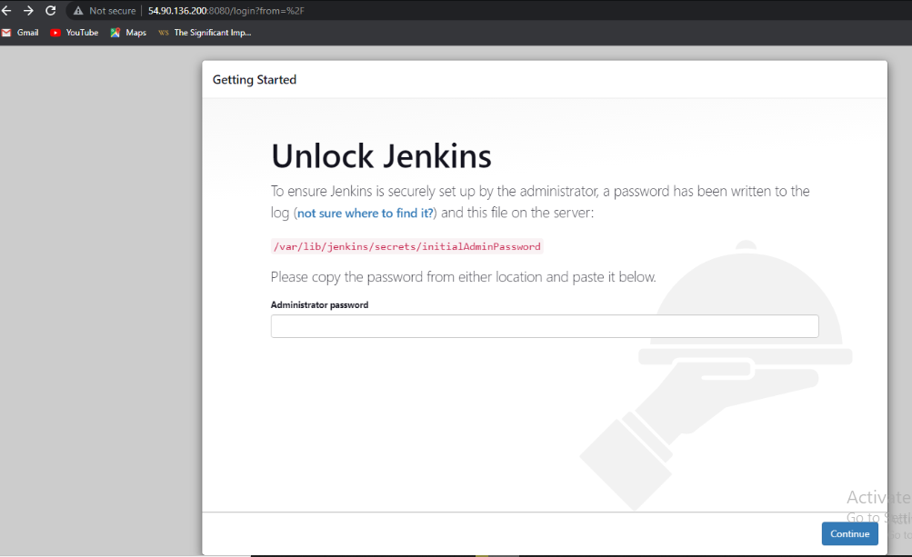
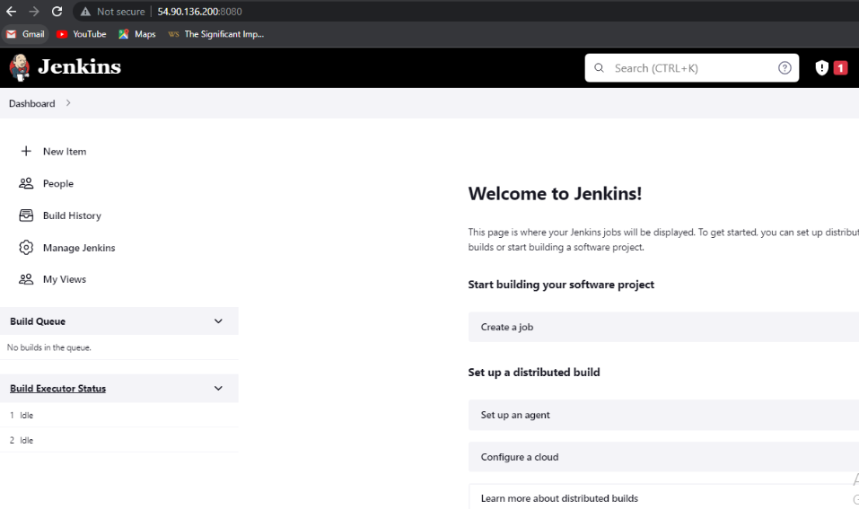

# PECTOR DOCUMENTATION FOR PROJECT 9
- Installation and configuration of Jenkins Server. After setting my server Inbound security group to port8080, I ran `sudo apt update`
`sudo apt install default-jdk-headless` `wget -q -O - https://pkg.jenkins.io/debian-stable/jenkins.io.key` | `sudo apt-key add -` `sudo sh -c 'echo deb https://pkg.jenkins.io/debian-stable binary/ > /etc/apt/sources.list.d/jenkins.list'` `sudo apt update` `sudo apt-get install jenkins`
Thereafter I access the Jenkins I created on using the Ip address on the web `sudo cat /var/lib/jenkins/secrets/initialAdminPassword`
, 
- Jenkins is a highly extendable application and there are 1400+ plugins available so I Install Publish over SSH, then configure the job on NFS server.
- The console output has some sensitive information which I cannot screenshot and save.

Thank You